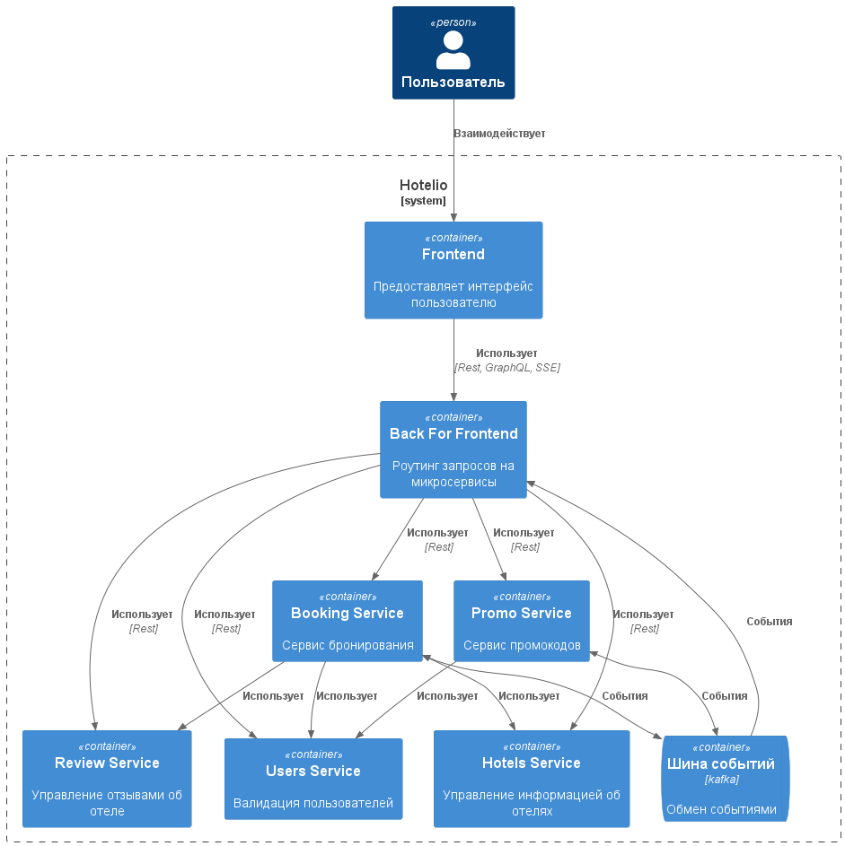
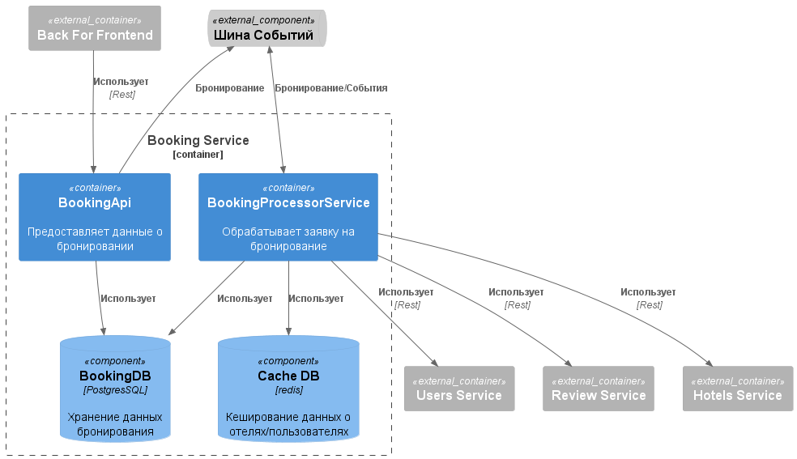
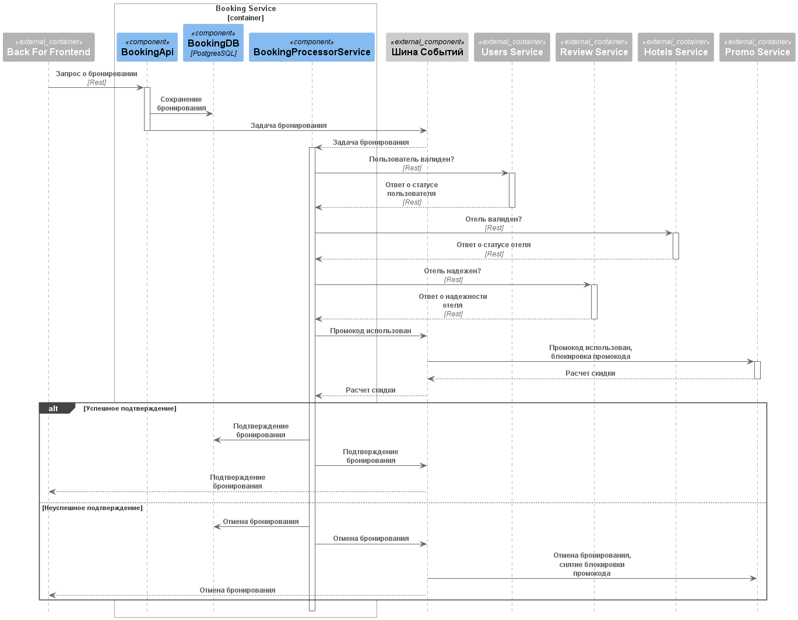

### **Название задачи:** Разбивка монолитной архитектуры для Hotelio
### **Автор:** Екатерина
### **Дата:** 28.08.2025
### **Функциональные требования**

**Текущие проблемы**
1. Сложность сопровождения
    - Любое изменение требует понимания всей кодовой базы.
    - Невозможно менять один модуль, не затрагивая другие.
2. Низкая масштабируемость
    - При пиковых нагрузках (например, на бронирование) нельзя масштабировать только нужный компонент.
    - Производительность неравномерна.
3. Невозможность гибкой разработки
    - Разные команды не могут работать независимо.
    - Трудно внедрить быстрый CI/CD.
4. Ограничения на фронтенде
    - REST API монолита слишком универсален и плохо адаптируется под разные платформы.
    - Нет поддержки BFF.
5. Сложности с запуском новых фич
    - Большой риск ошибок из-за плотной связанности.
    - Тестирование требует понимания всех зависимостей.

**Цели бизнеса**

Начать поэтапный переход к микросервисной архитектуре, применяя паттерн Strangler Fig, — выносить по одному компоненту, оставляя остальной функционал в монолите. Это позволит упростить масштабирование, снизить время выхода фич, повысить отказоустойчивость и упростить независимую разработку разных команд.

Финальное целевое состояние через год:
- Полный переход на микросервисную архитектуру.
- Service mesh с автоматизированными rollouts.
- Масштабируемая Kafka-инфраструктура.
- Метрики и трассировка на каждый сервис.
- GraphQL для фронтенда

|**№**|**Действующие лица или системы**|**Use Case**|**Описание**|
| :-: | :- | :- | :- |
| | | | |

### **Нефункциональные требования**

|**№**|**Требование**|
| :-: | :- |
| | |

### **Решение**

Архитектура состоит из ряда микросервисов, которые отвечают за свою единую зону ответственности.

**Frontend** сервис предоставляет пользователю доступ к информации в удобном виде.

**BackForFrontend** сервис отвечает за реализацию GraphQL доступа к данными, и решает задачу роутинга запросов от Frontend к остальным микросервисам.
Так же обеспечивает обработку событий из очереди и отправляет на Frontend события через SSE (например подтверждение или отмена бронирования).

**UsersService** отвечает за хранение и валидацию пользователей по всей системы. Предоставляет API для остальных сервисов.

**HotelsService** отвечает за хранение данных об отелях. Предоставляет API для остальных сервисов.

**ReviewService** отвечает за хранение отзывов об отелях, а так же реализует логику выдачи доверительного знака для отеля.

**PromoService** отвечает за валидацию промокодов, их резервирование и расчет размера скидки. 
Предоставляет АПИ для быстрого доступа к информации о промокоде.
Расчет размера скидки реализуется отдельным микросервисом, в котором происходит вся бизнес логика расчета скидок.

**BookingService** отвечает за осуществление бронирования и предоставления данных для просмотра истории.
Состоит из АПИ для быстрого доступа к данным для чтения.
Реализует паттерн CQRS, все заявки на бронирование обрабатываются в отдельном асинхронном сервисе.
В этом сервисе происходит полная валидация всех необходимых сервисов, посредством API запросов с кешированием или чтением событий из очереди.
Данные о пользователе и отеле валидируются синхронно посредством API запросов, в то время как расчет скидки происходит в асинхронном режиме через отдельный сервис промокодов.

**Описание порядка бронирования**

### **Альтернативы**

В предложенной архитектуре все еще остается связанность между **BookingService** и другими сервисами, необходимыми для бронирования. Можно уменьшить связанность, если перевести всю коммуникацию между сервисами на события и синхронизацию необходимых данных в каждом сервисе.
Это потребует дополнительной разработки микросервисов для синхронизации данных и может привести к быстрому росту используемой памяти каждым сервисом.

**Недостатки, ограничения, риски**

1. В текущей архитектуре есть слабое место - общая шина данных, которая может стать единой точкой отказа. Для минимизации рисков необходимо обеспечить высокую надежность за счет реплицировании и сборки кластера шины данных, чтобы отказ одного из узла шины не приводил к отказу всей системы бронирования.
2. Во время прогревки кеширования Redis могут возникнуть пиковые нагрузки на связанных АПИ сервисах.

